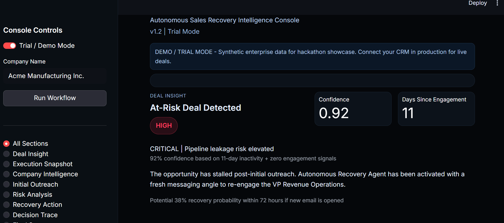

# Closeloop

Closeloop is an autonomous closed-loop sales recovery system.

It does more than generate an email. It runs a full loop:

1. Understand account context
2. Draft outreach
3. Monitor engagement signals
4. Detect risk
5. Trigger recovery action

The output of each run is both machine-usable and human-auditable: `final_state` + `logs`.



## Architecture Files

New architecture documentation is available in:

- `docs/architecture/system-architecture.md`: complete architecture explanation
- `docs/architecture/component-diagram.mmd`: component relationship diagram (Mermaid)
- `docs/architecture/workflow-sequence.mmd`: execution sequence diagram (Mermaid)

## High-Level Idea

Closeloop combines:

- LLM-driven generation for research and messaging
- Deterministic rules for monitoring and risk scoring
- A strict orchestrated workflow to keep behavior consistent
- Typed logs for decision traceability

This creates a reliable system that can be demoed safely and inspected clearly.

## File Guide (What Each File Is Used For)

### Root

- `app.py`: Streamlit dashboard UI and run controls
- `README.md`: project overview and file usage guide
- `.env`: local environment variables (`GEMINI_API_KEY`, optional model)
- `pyproject.toml`: package metadata and dependency config
- `assets/dashboard.png`: dashboard image used in docs
- `assets/architecture.png`: architecture image placeholder used in docs

### Core Workflow

- `src/closeloop/state.py`: shared `SalesWorkflowState` schema and initializer
- `src/closeloop/logging_layer.py`: typed log entries and render helpers
- `src/closeloop/orchestrator.py`: sequential execution pipeline
- `src/closeloop/__init__.py`: package entry definitions

### Agent Modules

- `src/closeloop/agents/research_agent.py`: account and persona enrichment
- `src/closeloop/agents/outreach_agent.py`: initial outreach email generation
- `src/closeloop/agents/monitoring_module.py`: engagement/inactivity updates
- `src/closeloop/agents/risk_detection_agent.py`: deterministic risk classification
- `src/closeloop/agents/recovery_agent.py`: recovery strategy and follow-up generation
- `src/closeloop/agents/__init__.py`: agent package exports

### Tests

- `tests/test_phase1_structure.py`: structure and orchestrator behavior checks
- `tests/test_agents_pipeline.py`: deterministic + mocked integration tests

### Architecture Docs

- `docs/architecture/system-architecture.md`: goals, components, data flow, decisions
- `docs/architecture/component-diagram.mmd`: system component mapping
- `docs/architecture/workflow-sequence.mmd`: step-by-step run order

## System Flow

1. UI receives `company_name`
2. Orchestrator runs all agents in sequence
3. Shared state is updated after each stage
4. Logging captures summaries and decisions
5. UI renders final outputs and trace

## Setup

1. Install the package

```bash
pip install -e .
```

2. Create/update `.env`

```env
GEMINI_API_KEY=your_key_here
GEMINI_MODEL=gemini-2.0-flash
```

3. Start dashboard

```bash
streamlit run app.py
```

4. Run tests

```bash
pytest -q
```

## Notes

- Use Demo Mode when quota is limited
- Use Live Mode for Gemini-backed runs
- Cached outputs can be reused for stable demos

## License

Internal project use.
